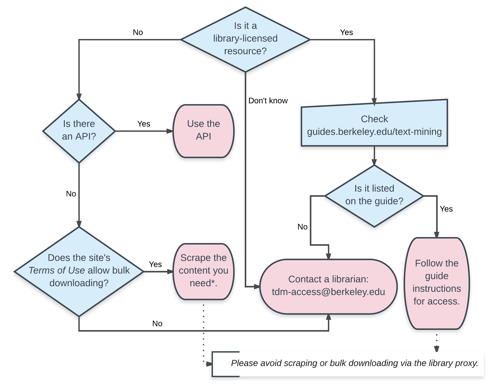
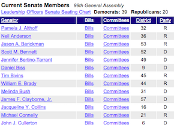
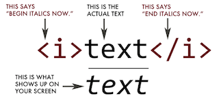
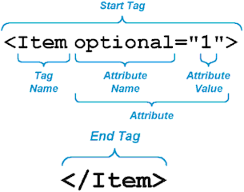
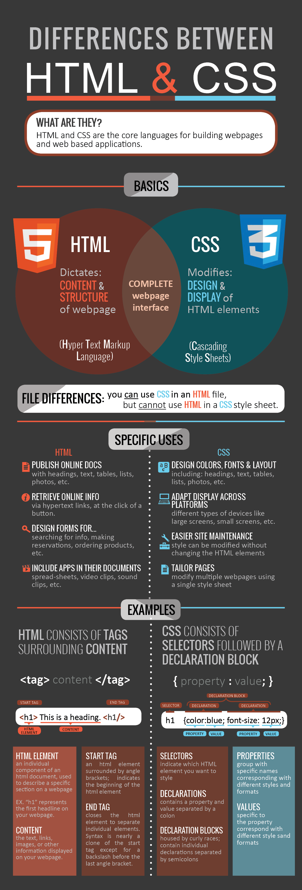
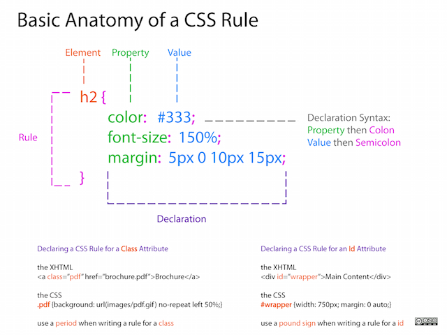
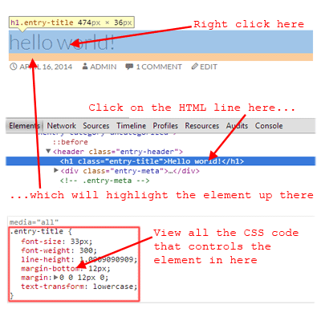

# Webscraping 1: HTML, CSS, and Developer Tools

> ## Learning Objectives
>
> *   Explain the difference between webscraping and working with APIs
> *   Understand how HTML works with your browser to display a website
> *   Identify HTML tags and attributes
> *   Understand how CSS works to format a website
> *   Identify CSS selectors
> *   Alter a website using Google Developer Tools.

### Accessing Data: Some Preliminary Considerations

Whenever you're trying to get information from the web, it's very important to first know whether you're accessing it through appropriate means.

The UC Berkeley library has some excellent resources on this topic. Here is a flowchart that can help guide your course of action.



You can see the library's licensed sources [here](http://guides.lib.berkeley.edu/text-mining).

## Why Webscrape

* Tons of web data useful for social scientists and humanists
	* social media
	* news media
	* government publications
	* organizational records

* Two kinds of ways to get data off the web
  * APIs - i.e. application-facing, for computers (last week)
	* Webscraping - i.e. user-facing websites for humans (this week and next week)

## Webscraping v. APIs

* Webscraping Benefits
	* Any content that can be viewed on a webpage can be scraped. [Period](https://blog.hartleybrody.com/web-scraping/)
	* No API needed
	* No rate-limiting or authentication (usually)

* Webscraping Challenges
	* Rarely tailored for researchers
	* Messy, unstructured, inconsistent
	* Entirely site-dependent

* Rule of thumb:
    - Check for API first. If not available, scrape.

## Some Disclaimers

* Check a site's terms and conditions before scraping.
* Be nice - don't hammer the site's server.
* Sites change their layout all the time. Your scraper will break.
 
## What's a website

* Some combination of codebase, database
* The "front end" product is HTML + CSS stylesheets + javascript


* Your browser turns that into a tidy layout



## Webscraping returns HTML

* It's easy to pull HTML from a website
* It's much more difficult to find the information you want from that HTML


* So we have to learn how to **parse** HTML to find the data we want

## Basic strategy of webscraping:

1. Find out what kind of HTML element your data is in. (Use your browser‘s “inspector” to)
2. Think about how you can differentiate those elements from other, similar elements in the webpage using CSS.
3. Use Python and add-on modules like BeautifulSoup to extract just that data.

## HTML: Basic structure

```html
<!DOCTYPE html>
<html>
   <head>
    <title>Page title</title>
  </head>
  <body>
    <p>Hello world!</p>
  </body>
</html>
```

## HTML is a Tree


Each branch of the tree is called an *element*

## HTML Elements

Generally speaking, an HTML element has three components:

1. Tags (starting and ending the element)
2. Atributes (giving information about the element)
3. Text, or Content (the text inside the element)


## HTML: Tags



[Image credit](http://miriamposner.com/blog/wp-content/uploads/2011/11/html-handout.pdf)

## Common HTML tags

| Tag        | Meaning           | 
| ------------- |-------------  |
| `<head>`     | page header (metadata, etc | 
| `<body>`     | holds all of the content |
| `<p>` | regular text (paragraph) |
| `<h1>`,`<h2>`,`<h3>` | header text, levels 1, 2, 3  |
| `ol,`,`<ul>`,`<li>` | ordered list, unordered list, list item |
| `<a href="page.html">` | link to "page.html" |
| `<table>`,`<tr>`,`<td>`  | table, table row, table item |
| `<div>`,`<span>` | general containers |

## HTML Attributes

* HTML elements can have attributes.
* Attributes provide additional information about an element.
* Attributes are always specified in the start tag.
* Attributes come in name/value pairs like: name="value"



## Finding HTML 

* Sometimes we can find the data we want just by using HTML tags or attributes (e.g, all the `<a>` tags)
* More often, this isn't enough: There might be 1000 `<a>` tags on a page. But maybe we want only the `<a>` tags *inside* of a `<p>` tag.
* Enter CSS

## CSS

* CSS = Cascading Style Sheet. 
* CSS defines how HTML elements are to be displayed
* HTML came first. But it was only meant to define content, not format it. While HTML contains tags like `<font>` and `<color>`, this is a very inefficient way to develop a website.
* To solve this problem, CSS was created specifically to display content on a webpage. Now, one can change the look of an entire website just by changing one file.
* Most web designers litter the HTML markup with tons of `class`'s and `id`'s to provide "hooks" for their CSS.
* You can piggyback on these "hooks" to jump to the parts of the markup that contain the data you need.
* The infographic [here](http://www.codingdojo.com/blog/html-vs-css-inforgraphic/) shows the difference between HTML and CSS and how together they form a web page:



## CSS Anatomy: Selectors

| Type  | HTML    | CSS Selector   | 
| :----- | :-------: | -------------:  |
| Element | `<a>`,     | `a` <br> `p a`| 
| Class | `<a class="blue">`  | `.blue` <br> `a.blue` |
| ID | `<a id="blue">` | `#blue` <br> `a#blue` |

## CSS Anatomy: Declarations

  - Selector: `a`
  - Property: `background-color`
  - Value: `yellow`

## CSS Anatomy: Hooks



## CSS + HTML

What does the following HTML render to?

```html
<body>
  <table id="content">
      <tr class='kurtis'>
          <td class='firstname'>
            Kurtis
          </td>
          <td class='lastname'>
              McCoy
          </td>
      </tr>
      <tr class='leah'>
          <td class='firstname'>
              Leah
          </td>
          <td class='lastname'>
              Guerrero
        </td>
      </tr>
  </table>
</body>
```

> #### Exercises 1
>
> Find the CSS selectors for the following elements in the HTML above.
> (Hint: There will be multiple solutions for each)
> 
> 1. The entire table
> 2. Just the row containing "Kurtis McCoy"
> 3. Just the elements containing first names

> #### Exercises 2
> 
> A great resource to practice your CSS selection skills is http://flukeout.github.io/
> Complete the first 10 execises

## Inspect Element

Google Chrome comes with great developer tools to help parse a webpage.

 

The inspector gives you the HTML tree, as well as all the CSS selectors and style information.

## Inspect Element



---
> #### Exercise 3
> 
> Go to http://rochelleterman.github.io/. Using Google Chrome's inspect element:
> 
> 1. Change the background color of each of the rows in the table
> 2. Find the image source URL
> 3. Find the HREF attribute of the link.
> 
> Useful CSS declarations [here](http://miriamposner.com/blog/wp-content
> uploads/2011/11/usefulcss.pdf)

> #### Extra Challenge:
> 
> Go to any website, and redesign the site using Google Chrome's inspect 
> element.
> 

## Putting it all together:

1. Use Inspect Element to see how your data is structured
2. Pay attention to HTML tags and CSS selectors
3. Pray that there is some kind of pattern
4. Leverage that pattern using Python

## Scraping Multiple Pages and Difficult sites

* We're start by scrape one webpage. But what if you wanted to do many?
* Two solutions:
    - URL patterns
    - Crawling ([Scrapy](http://scrapy.org/))
* Lots of javascript or other problems? Check out [Selenium for Python](https://selenium-python.readthedocs.org/)


**To the iPython Notebook!**